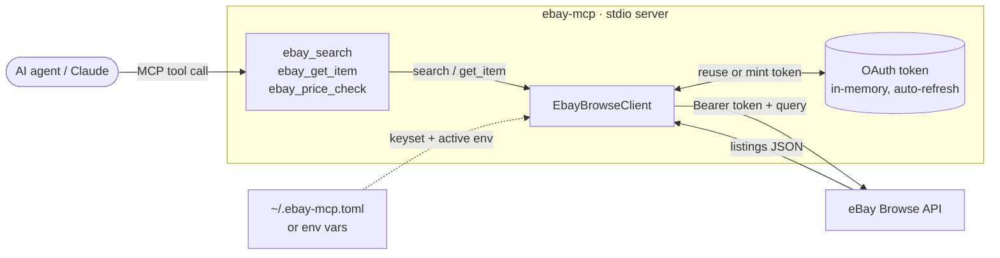
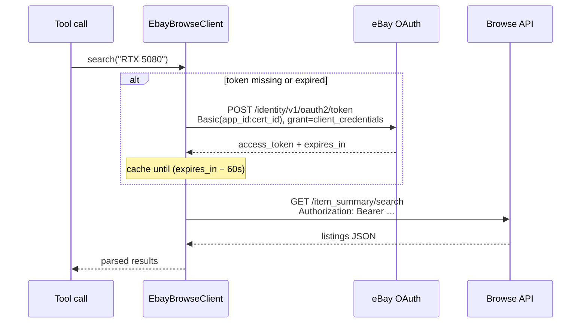
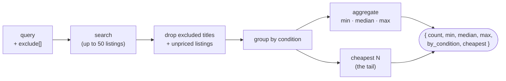
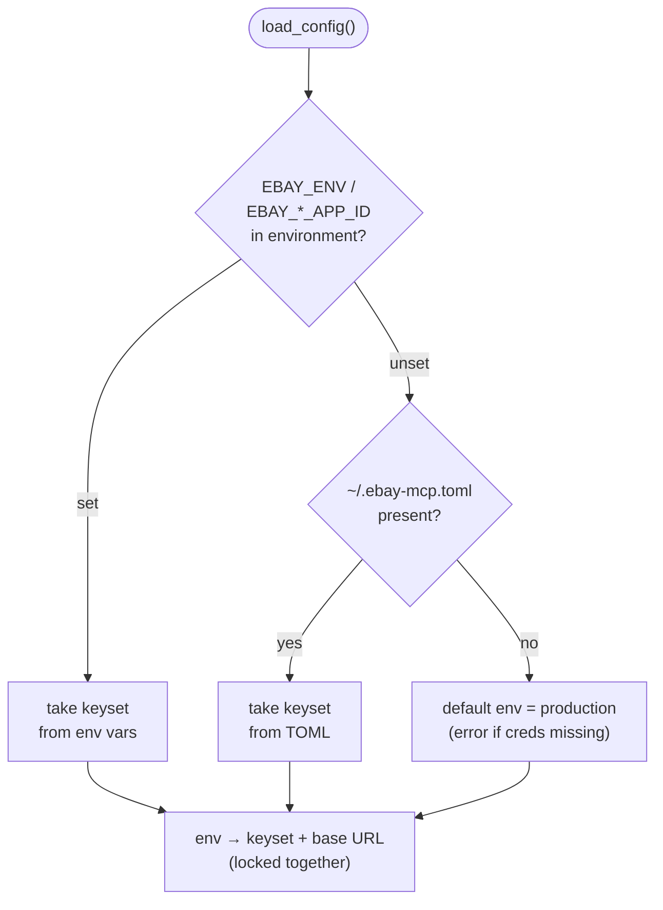

# ebay-mcp

<!-- mcp-name: io.github.cunicopia-dev/ebay-mcp -->


**Give an AI agent real, live market prices — straight from the largest
secondhand marketplace on the internet.**

eBay is a continuously-updating ledger of what physical things actually cost
right now. This wraps its [Browse API](https://developer.ebay.com/api-docs/buy/browse/overview.html)
as an [MCP](https://modelcontextprotocol.io) server with three tools, so an agent
can search listings, pull a single item, and — the useful one — get an aggregated
**price landscape** for anything: min, median, max, broken down by condition.

> Python 3.12+ · MIT · MCP server · app-token auth, no user login

Setup is one free eBay app keyset — no user login, no OAuth consent screen to
click through. Point an agent at it and ask "what does an RTX 5080 actually go
for?" — one call back comes a grounded answer, split by condition, with the
cheapest listings attached.

---

## Contents

- [The three tools](#the-three-tools)
- [Architecture: one client, three tools](#architecture-one-client-three-tools)
- [Authentication: client-credentials, cached](#authentication-client-credentials-cached)
- [`ebay_price_check`: how the landscape is built](#ebay_price_check-how-the-landscape-is-built)
- [Install](#install)
- [Configuration](#configuration)
- [Sandbox vs. production](#sandbox-vs-production)
- [Project layout](#project-layout)
- [License](#license)

---

## The three tools

| Tool | What it does |
| ---- | ------------ |
| **`ebay_price_check`** | Aggregated price landscape for a query — count, min/median/max, a breakdown by condition, and the cheapest listings. The headline tool. |
| **`ebay_search`** | Listing search with sorting and filtering — returns clean `{itemId, title, price, condition, seller, itemWebUrl}` rows. |
| **`ebay_get_item`** | Full detail for one item by ID. |

```jsonc
// ebay_price_check  ·  query: "RTX 5080", exclude: ["laptop", "notebook"]
{
  "count": 47, "currency": "USD",
  "min": 899, "median": 1099, "max": 2200,
  "by_condition": {
    "New":  { "count": 18, "min": 1099, "median": 1199, "max": 1634 },
    "Used": { "count": 21, "min": 899,  "median": 1050, "max": 1499 }
  },
  "cheapest": [ { "price": 899, "condition": "Used", "title": "…", "itemWebUrl": "…" } ]
}
```

---

## Architecture: one client, three tools

Every tool flows through a single `EbayBrowseClient`, which owns the token and
talks to eBay. There's one place credentials are read, one place a token is
cached, one place HTTP happens — nothing to drift.



The server is async; the client is plain synchronous `requests`, run in a thread
(`asyncio.to_thread`) so a slow eBay call never blocks the event loop.
`ebay_price_check` is the one tool that does more than pass through — it runs a
search and then aggregates the result (see [below](#ebay_price_check-how-the-landscape-is-built)).

---

## Authentication: client-credentials, cached

eBay's Browse API uses an **application token** (the OAuth client-credentials
grant) — no user is involved. The client mints one on first use, caches it in
memory, and silently refreshes when it's about to expire. You never think about
it.



The 60-second buffer means a token is treated as expired slightly early, so a
call never races a token that dies mid-flight. Tokens live ~2 hours; in practice
one fetch covers a long session.

---

## `ebay_price_check`: how the landscape is built

The other two tools are thin wrappers. This one is the reason the project
exists: it turns a pile of raw listings into a number you can reason about.



`exclude` is what makes the number honest — a search for `"RTX 5080"` is full of
laptops and prebuilt PCs, and `exclude: ["laptop", "notebook", "prebuilt"]`
strips them so the median reflects the actual card. The `by_condition` split
matters just as much: a "median" that blends new-in-box with used-and-abused is
noise; split by condition and each tier tells the truth.

> One honest limitation worth knowing: the Browse API returns **active asking
> prices**, not completed sales. Treat the floor as "best currently advertised,"
> not "what it sold for."

---

## Install

```bash
git clone https://github.com/cunicopia-dev/ebay-mcp
cd ebay-mcp
python3.12 -m venv .venv && source .venv/bin/activate
pip install -e .
```

You need a (free) eBay developer **application keyset** — see
[docs/SETUP.md](docs/SETUP.md) for the five-minute walkthrough. Then wire it into
your MCP client:

```json
{
  "mcpServers": {
    "ebay": { "command": "/path/to/ebay-mcp/.venv/bin/ebay-mcp" }
  }
}
```

---

## Configuration

Credentials come from **environment variables** (highest priority) or a
**`~/.ebay-mcp.toml`** file. The active `env` selects the keyset *and* the API
base URL together — so production creds can never accidentally point at the
sandbox, or vice versa.



```toml
# ~/.ebay-mcp.toml   (chmod 600)
env = "production"

[production]
app_id  = "YourApp-PRD-..."
cert_id = "PRD-..."

[sandbox]
app_id  = "YourApp-SBX-..."
cert_id = "SBX-..."
```

Check what's active any time — credentials are masked in the output:

```bash
ebay-mcp-config
# env:      production
# app_id:   Keit****87dd
# cert_id:  PRD-****0914
# api_base: https://api.ebay.com
# OK — configuration is valid.
```

---

## Sandbox vs. production

Flip `env` between `sandbox` and `production` to switch environments — same code,
different endpoints and keyset. The sandbox is good for proving the auth flow
wires up; its inventory is sparse and seeded, so for real prices you want a
production keyset.

---

## Project layout

```
src/ebay_mcp/
  config.py    # env + TOML loader; ebay-mcp-config CLI
  browse.py    # EbayBrowseClient — OAuth cache + search / get_item
  server.py    # MCP server: list_tools / call_tool / main
tests/         # config precedence, aggregation, tool listing (no network)
docs/SETUP.md  # getting an eBay keyset
```

---

## License

MIT
